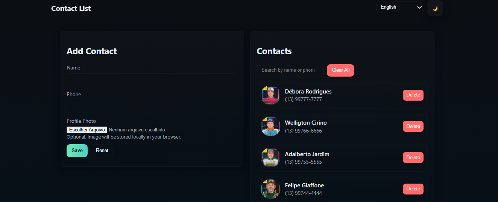

# Creating a Flutter Contact List App

Project developed at Santander Bootcamp 2023 - Mobile with Flutter, under the guidance of specialist [Danilo Perez](https://github.com/perez-danilo "Danilo Perez").

The goal of the challenge is to leverage external packages to enhance Flutter applications by building a contact list app that displays contact information - ncluding photos - in a list format.

**Challenge Checklist**:

- Create a Flutter application.
- Create a database / Back4App.
- Implement user registration with a profile photo.
- Save only the image path to the database.
- Display a list of people with their respective photos.
- Use other components learned.

## Features

- Create contacts with **name**, **phone**, and **profile photo**
- Save **only the local image path** to Back4App
- List contacts with profile images loaded from local storage
- Delete contacts from Back4App
- Uses `image_picker`, `path_provider`, and `parse_server_sdk_flutter`

## Prerequisites

- Flutter SDK installed (stable channel)
- A Back4App account and an app created
- Android Studio or Xcode for device/emulator testing

## Back4App Setup

1. Create a new app on Back4App.
2. In the Back4App dashboard create a class named **Contact**.
3. Add the following fields to the **Contact** class:
   - **name** - String
   - **phone** - String
   - **imagePath** - String
4. Get your **Application ID**, **Client Key**, and **Server URL** from Back4App.

## Configuration

1. Open `lib/main.dart`.
2. Replace the placeholders with your Back4App credentials:

```dart
const String appId = 'YOUR_APP_ID';
const String clientKey = 'YOUR_CLIENT_KEY';
const String serverUrl = 'https://parseapi.back4app.com';
```

## Permissions

### Android

Add the following to ``android/app/src/main/AndroidManifest.xml`` if needed (modern ``image_picker`` handles runtime permissions):

```xml
<uses-permission android:name="android.permission.READ_EXTERNAL_STORAGE"/>
<uses-permission android:name="android.permission.WRITE_EXTERNAL_STORAGE"/>
```

For Android 13+ you may need ``READ_MEDIA_IMAGES`` instead of ``READ_EXTERNAL_STORAGE``.

### iOS

Add these keys to ios/Runner/Info.plist:

```xml
<key>NSPhotoLibraryUsageDescription</key>
<string>We need access to your photo library to pick profile images.</string>
```

## Run the App

1. Get dependencies:

    ```bash
    flutter pub get
    ```

2. Run on an emulator or device:

    ```bash
    flutter run
    ```



## Important Notes

- Local path limitation: The app saves the local file path to Back4App. That path is device-specific. If the app is installed on another device, the saved path will not point to a valid image there.
- Recommended improvement: For cross-device availability, upload images to remote storage (e.g., Back4App ``ParseFile``, Firebase Storage, or S3) and save the remote URL instead of a local path.
- Error handling: The sample code includes basic error handling. Consider adding more robust offline handling and retries for production.
- Security: Do not commit your Back4App keys to public repositories. Use environment variables or a secure secrets manager for production.

## Optional Enhancements

- Upload images to Back4App as ParseFile and store the remote URL.
- Add contact editing and search.
- Add pagination and offline caching.
- Add unit and widget tests.

[LICENSE](/LICENSE)
